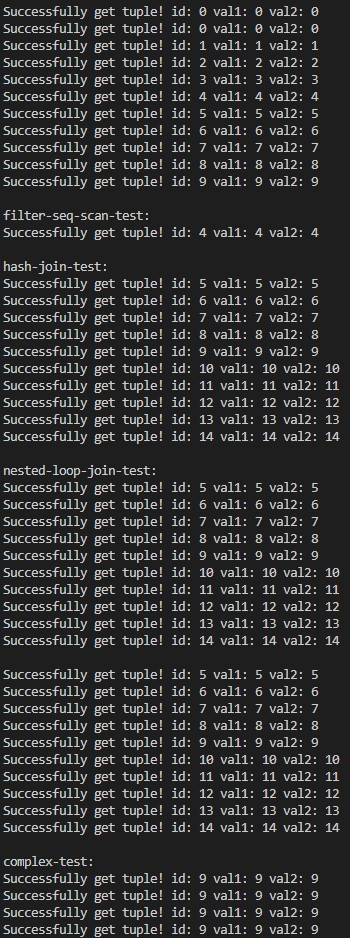

# Self-made query excution

## Introduction

My self-made query excution function in a database system. 

Implement executors that are responsible for taking query plans and executing them.

## Academic Integrity Policy

In order to respect our university's academic integrity policy and copyright of professor. I have decided not to show code of tests, including the specific requirements of this assignment.

## Tests

Create executors that perform sequential scans, hash joins and aggregations. Here are output of my code.

